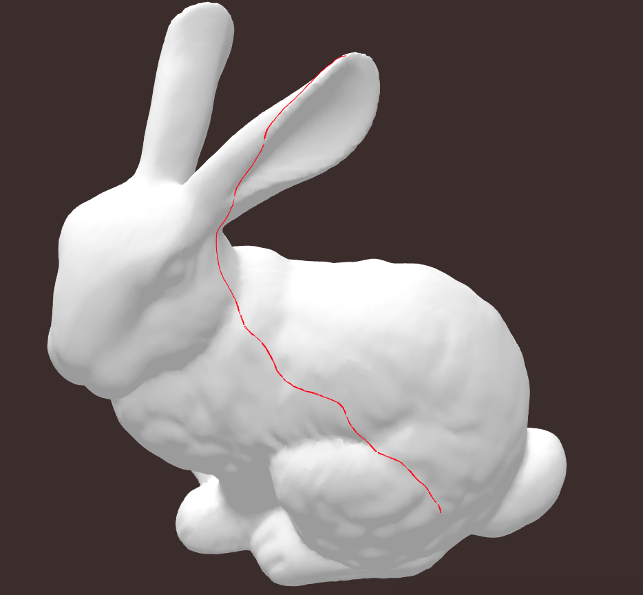
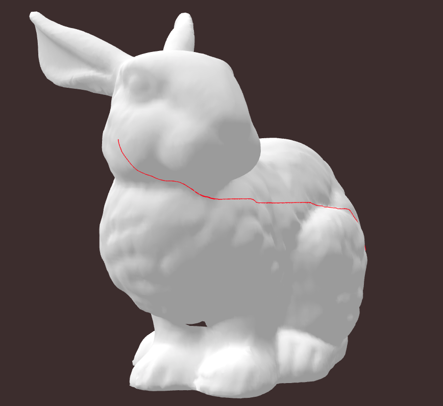
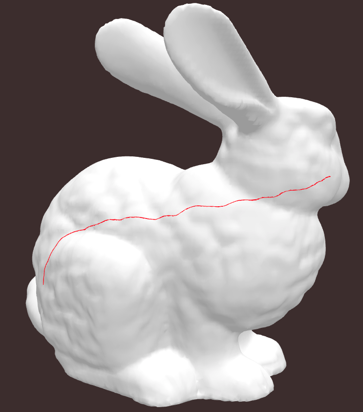
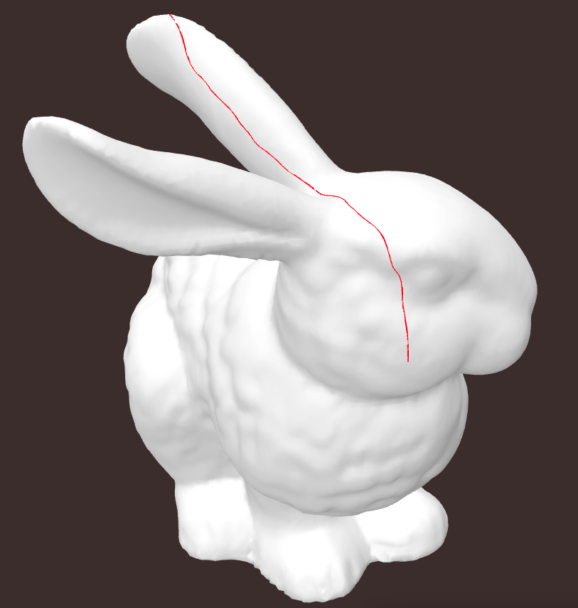

<div align="center">

  <h1><code>geodesic-path</code></h1>

  <strong>Geodesic path calculation example </strong>

</div>

## 🚴 Usage

```
cd www
npm i
npm run build
```
* path calculation [src/lib.rs](src/lib.rs)

* visualization [www/src/index.ts](www/src/index.ts)








